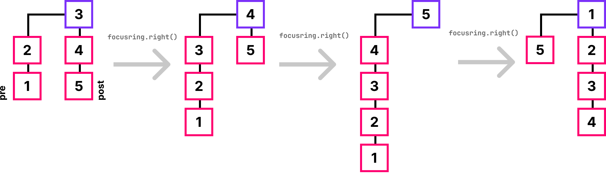

## Focusring
- Das Prinzip
  - Was ist ein Focusring?
  - Features
- Implementation
- Beispiel Applikation


### Was ist ein Fokusring?
- Datenstruktur die wie ein Ring funktioniert
- verwendet Iteratoren
- Anwendbar für:
  - Image Gallery
  - Walzen - Selektoren
  - ...


### Features
- Effiziente Datenstruktur
- Direkter Zugriff auf den Fokus
- Immutable
- Nie endende Iteration


### Funktionsweise



### Verwendung
```js [1-3|5-6|8-10|12-13]
// creates a Focus Ring with the elements from the ArrayIterator
const elems           = ArrayIterator([1,2,3]);
const focusRing       = FocusRing(elems);
  
// the element which is currently in the focus
const focusElement    = focusRing.focus();

// the element to the right or left of the focus
const rightElement    = focusRing.right().focus();
const leftElement     = focusRing.left() .focus();
  
// since the focusring is immutable, it must be reassigned
const shiftedFocusRing = focusRing.right();
```


### Beispiel Anwendung

<iframe style="border: none" width="100%" height="600" data-src="https://wildwyss.github.io/ip5-overview/contrib/p5_wild_wyss/src/focusring/example/SlotMachine.html" data-preload></iframe>

