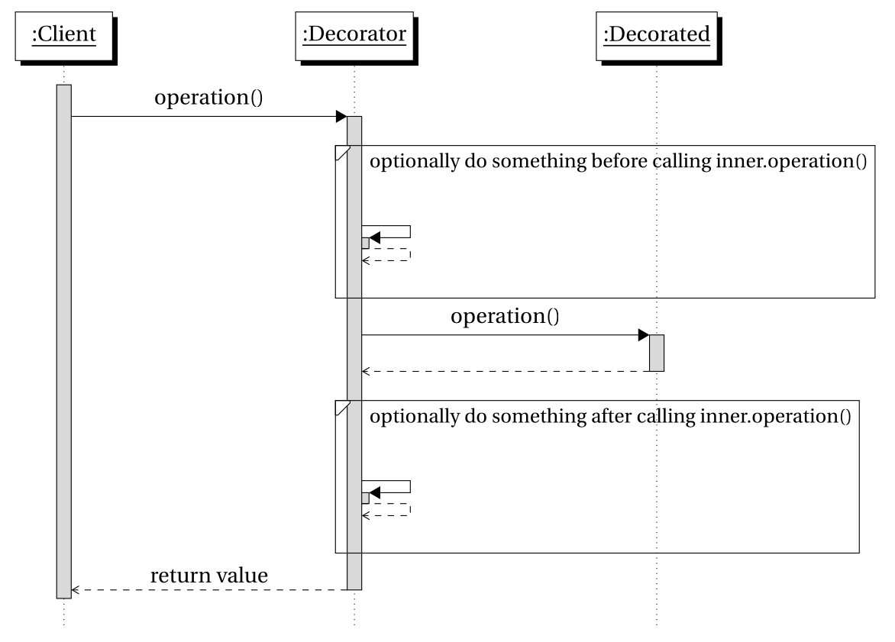

### Sequence Library
#### Was ist eine Sequence?
_Eine Folge von endlichen oder unendlichen Daten._<!-- .elements class="fragment" data-fragment-index="1" -->

1, 3, 5, 7, 9, ...<!-- .elements class="fragment" data-fragment-index="2" -->

True, True, False, True, True, False<!-- .elements class="fragment" data-fragment-index="2" -->

a, ab, abc, abcd, abcde, ...<!-- .elements class="fragment" data-fragment-index="2" -->

Note:
- Was ist eine Sequence? In anderen Sprachen würde man vllt von Liste sprechen, aber lazy liste


### Basis der Sequence - Die Iteration Protocols
```js[1| 1-2 | 1-4 | 1-5 |1-6 | 1-7]
const list = [0, 1];
const iterator = list[Symbol.iterator]();

iterator.next(); // returns { done: false, value: 0 }
iterator.next(); // returns { done: false, value: 1 }
iterator.next(); // returns { done: true,  value: undefined }
iterator.next(); // returns { done: true,  value: undefined }
```


### Implementierung der Iteration Protocols 
```js[1, 7| 4-6 | 2]
const InfiniteOnesIterable = () => {
  const next = () => ({ done: false, value: 1 });

  return {
    [Symbol.iterator]: () => ({ next })
  }
};
```


### Implementierung der Iteration Protocols 
```js[|]
const InfiniteOnesIterable = () => {
  const next = () => ({ done: false, value: 1 });

  return {
    [Symbol.iterator]: () => ({ next })
  }
};
```

```js[]
const [one, anotherOne, andOneAgain] = InfiniteOnesIterable();

for (const _one of InfiniteOnesIterable()) { 
  // hangs forever, since done is always false
}
```


### Implementierung der Sequence 
```js[1 | 3-13 | 1-16]
const Sequence = (start, whileFunction, incrementFunction) => {

  const iterator = () => {
    let value = start;

    const next = () => {
      const current = value;
      const done = !whileFunction(current);
      if (!done) value = incrementFunction(value);
      return { done, value: current };
    };
    
    return { next };
  };

  return  /* omitted */;
};
```


### Verwendung einer Sequence 
```js[1-3 | 5 | 7-10]
const startValue        = 0;
const whileFunction     = x => x < 10;
const incrementFunction = x => x + 2;

const seq = Sequence(startValue, whileFunction, incrementFunction);

for (const elem of seq) {
  console.log(elem);
}
// => Logs '0, 2, 4, 6, 8'
```


### Verarbeiten einer Sequence

Ziel: Funktionalitäten wie filter, map, usw. auf Sequence anwenden! <!-- .elements class="fragment" data-fragment-index="1" -->

Lösung: Decorator Pattern<!-- .elements class="fragment" data-fragment-index="2" -->


### Decorator Pattern 



### Implementierung von _map_
```js
const map = mapper => iterable => {
  const mapIterator = () => {
    const inner = iteratorOf(iterable);
    let mappedValue;
    
    const next = () => {
      const { done, value } = inner.next();
      if (!done) mappedValue = mapper(value);
      return { done, value: mappedValue }
    };
    
    return { next };
  };

  return createMonadicSequence(mapIterator); 
};
```


### Vorteile des Decorator Approach 
```js[]
const sequence = Sequence(0, x => x < 10, x => x + 1);
const mapped   = map(x => x * 2)(sequence);
```

- Receiver ist letztes Argument
- Lazy evaluation
- Alle iterables prozessierbar

Note:
- Receiver letztes Argument: 
  - ermöglicht eta-reduzierung des receiver
  - ermöglicht konfigurierbare Funktionen
  - ermöglicht Verwendung mit allen Iterables
-Lazy evaluation
  - Durch befolgen der Iteration Protokolle der Sequence und der Decorators werden alle Werte lazy evaluiert
